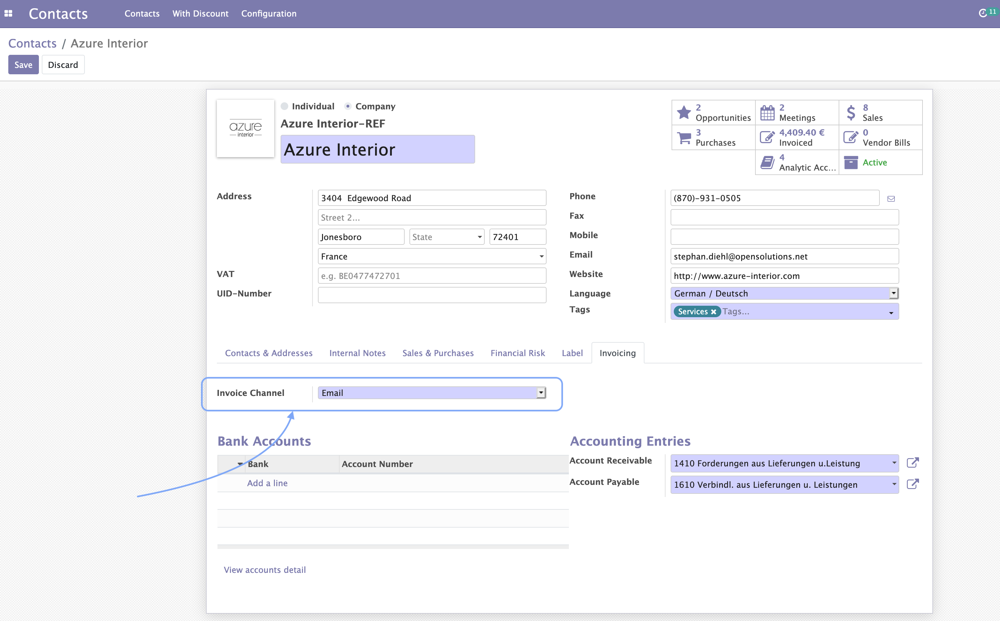
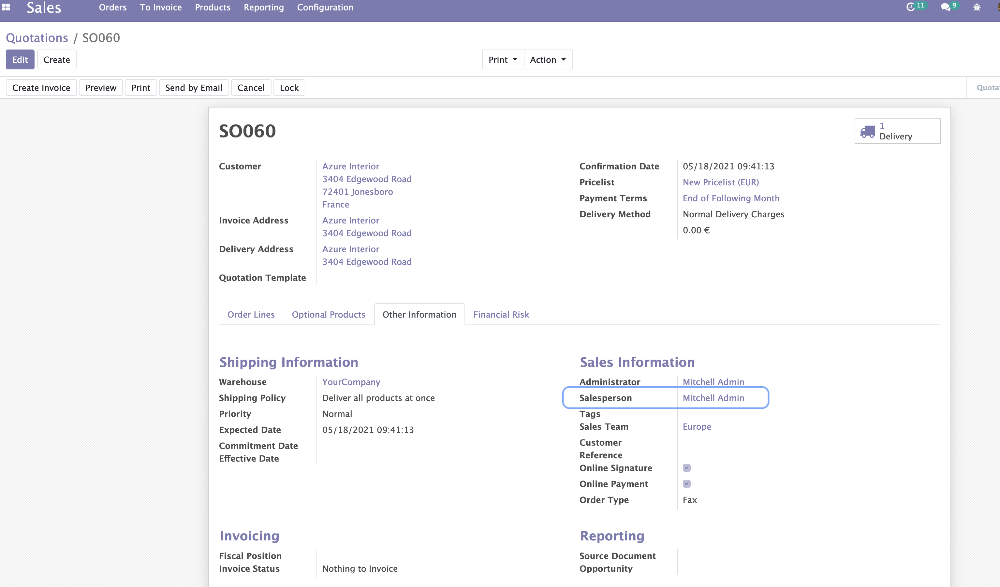
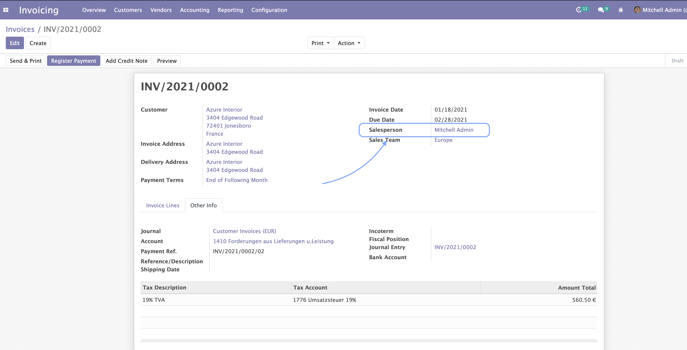

.. image:: static/description/alliantum.png
   :alt: Alliantum
   :width: 100 %
   :scale: 70 %
   :align: center

=================
Automatic Mailing
=================

.. !!!!!!!!!!!!!!!!!!!!!!!!!!!!!!!!!!!!!!!!!!!!!!!!!!!!
   !! This file is generated by oca-gen-addon-readme !!
   !! changes will be overwritten.                   !!
   !!!!!!!!!!!!!!!!!!!!!!!!!!!!!!!!!!!!!!!!!!!!!!!!!!!!

.. |badge1| image:: https://shields.io/badge/Beta-yellow?style=for-the-badge&label=Maturity
    :target: https://alliantum.com/development-status
    :alt: Beta
.. |badge2| image:: https://shields.io/badge/AGPL--3-blue?style=for-the-badge&label=License
    :target: http://www.gnu.org/licenses/agpl-3.0-standalone.html
    :alt: License: AGPL-3
.. |badge3| image:: https://shields.io/badge/Alliantum%2fodoo_automatic_mailing-24c3f3?style=for-the-badge&logo=github&label=github
    :target: https://github.com/Alliantum/odoo_automatic_mailing/tree/master
    :alt: Alliantum/odoo_automatic_mailing

|badge1| |badge2| |badge3| 

Some technical modules from Odoo can give you the options for automating
certain processes under special circumstances, however, if the only
thing that you need is decide different email templates and in which
cases you want them to be sent at Sales Order confirmation or Invoice
validation, this module makes it really easy to start.

This module allows you to easily send emails automatically at Sale Order
confirmation or Invoice validation.

But not just, you can create rules, to decide when to send those emails
based on conditions, like for example, depending on certain kind of
Customers, and choose the email template you want to use for those
situations. An everything in a simple and intuitive way.

**Table of contents**

.. contents::
   :local:

Configuration
=============

To configure this module, you need to:

1. Go to Settings / General Settings and scroll down to section
   ``Automatic Mailing``. There you can click the button
   ``Manage Automatic Mailing`` and start adding your rules. Pay
   attention that if you’re in debug mode, a code editor field will be
   also available for you to enter more specific domains.

.. image:: static/description/rules.png
   :alt: Alliantum
   :width: 100 %
   :scale: 70 %
   :align: center

2. Once you have the rules set, you can enable this behavior
   specifically for your Contacts. You will find the option under the
   tab ``Invoicing``. Notice here, that the option must be set to
   **Email** in order to activate the automatic mails.

3. You can also decide if you want to get a copy of the email just sent
   to the customer. These copies will be sent to the Salesperson of the
   Sale Order or Invoice, not the user clicking the button ‘Confirm’ or
   ‘Validate’!

Enable this option for a Salesperson, is that easy as doing click on the
top right corner ( user profile menu) and then clicking on Preferences.
There you’ll fin the option ``Enable Mail Receivable``. Keep it check to
start getting the copies of your emails.

Usage
=====

Once everything is set up, then all you need to do is go to one of your
Sale Orders or Invoices, and confirm or validate it. You’ll see then how
a new message is posted in the chatter below, with the content of the
email just sent and the status.

In case you have also configured the email copy for the Salesperson, a
second message will be displayed there too.

Bug Tracker
===========

Bugs are tracked on `GitHub Issues <https://github.com/Alliantum/odoo_automatic_mailing/issues>`_.
In case of trouble, please check there if your issue has already been reported.
If you spotted it first, help us smashing it by providing a detailed and welcomed
`feedback <https://github.com/Alliantum/odoo_automatic_mailing/issues/new?body=module:%20odoo_automatic_mailing%0Aversion:%20master%0A%0A**Steps%20to%20reproduce**%0A-%20...%0A%0A**Current%20behavior**%0A%0A**Expected%20behavior**>`_.

Do not contact contributors directly about support or help with technical issues.

Credits
=======

Authors
~~~~~~~

* Alliantum

Contributors
~~~~~~~~~~~~

-  David Moreno david.moreno@alliantum.com
-  Jose Robles jose.robles@alliantum.com
-  Iago Alonso iago.alonso@alliantum.com

Other credits
~~~~~~~~~~~~~

The development of this module has been financially supported by:

-  Alliantum (https://www.alliantum.com)

Maintainers
~~~~~~~~~~~

This module is maintained by Alliantum.

.. image:: https://avatars.githubusercontent.com/u/68618709?s=200&v=4
   :alt: Alliantum
   :target: https://alliantum.com

Alliantum, is a company whose
mission is to support the widespread use of Odoo by others companies, and collaborate in the development of new Odoo features.

This module is part of the `Alliantum/odoo_public_modules <https://github.com/Alliantum/odoo_public_modules>`_ project on GitHub.

You are welcome to contribute. To learn how please visit https://github.com/Alliantum/odoo_public_modules.

