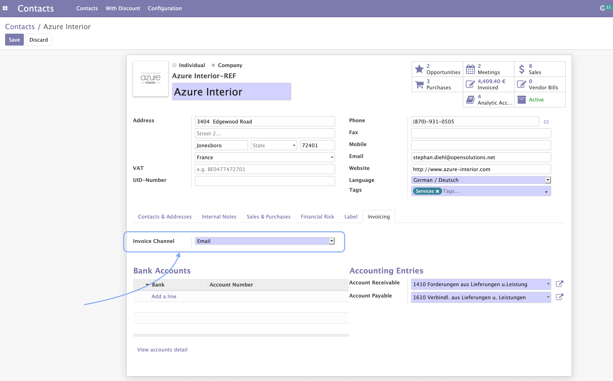

To configure this module, you need to:

1. Go to Settings / General Settings and scroll down to section `Automatic Mailing`. There you can click the button `Manage Automatic Mailing` and start adding your rules. Pay attention that if you're in debug mode, a code editor field will be also available for you to enter more specific domains.

    

        
    

2. Once you have the rules set, you can enable this behavior specifically for your Contacts. You will find the option under the tab `Invoicing`. Notice here, that the option must be set to **Email** in order to activate the automatic mails.

    

        
    

3. You can also decide if you want to get a copy of the email just sent to the customer. These copies will be sent to the Salesperson of the Sale Order or Invoice, not the user clicking the button 'Confirm' or 'Validate'!

    

        
    

    

        
    

Enable this option for a Salesperson, is that easy as doing click on the top right corner ( user profile menu) and then clicking on Preferences. There you'll fin the option `Enable Mail Receivable`. Keep it check to start getting the copies of your emails.
