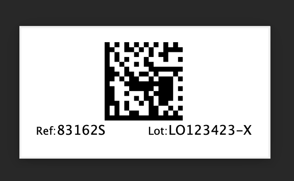

=================
Extended Barcodes
=================

.. !!!!!!!!!!!!!!!!!!!!!!!!!!!!!!!!!!!!!!!!!!!!!!!!!!!!
   !! This file is generated by oca-gen-addon-readme !!
   !! changes will be overwritten.                   !!
   !!!!!!!!!!!!!!!!!!!!!!!!!!!!!!!!!!!!!!!!!!!!!!!!!!!!

.. |badge1| image:: https://shields.io/badge/Beta-yellow?style=for-the-badge&label=Maturity
    :target: https://alliantum.com/development-status
    :alt: Beta
.. |badge2| image:: https://shields.io/badge/AGPL--3-blue?style=for-the-badge&label=License
    :target: http://www.gnu.org/licenses/agpl-3.0-standalone.html
    :alt: License: AGPL-3
.. |badge3| image:: https://shields.io/badge/Alliantum%2fodoo_extended_barcodes-24c3f3?style=for-the-badge&logo=github&label=github
    :target: https://github.com/Alliantum/odoo_extended_barcodes/tree/master
    :alt: Alliantum/odoo_extended_barcodes

|badge1| |badge2| |badge3|

In general, the default types of barcodes that Odoo is able to generate
is all you may need for most of your business processes.

But sometimes, may raise situations when those barcodes are very limited
or don’t behave as well as expected. For example, you may need to print
very small barcodes inside a very constraint space in one of your
documents, but the resulting Odoo’s barcode doesn’t look good, it can be
too blurry to be read by a barcode scanner, while, for example using a
different type of barcode (maybe a DataMatrix) can work much better than
a traditional linear barcode.

This module extends the available types of barcode images that Odoo is
able to produce. By default, from the Odoo documentation the accepted
options were:

-  Codabar
-  Code11
-  Code128
-  EAN13
-  EAN8
-  Extended39
-  Extended93
-  FIM
-  I2of5
-  MSI
-  POSTNET
-  QR
-  Standard39
-  Standard93
-  UPCA
-  USPS_4State

After installing this module. The default types will be extended with
all these new kind of barcode types:

Tbarcode 7 codes

-  BARCODE_CODE11
-  BARCODE_C25MATRIX
-  BARCODE_C25INTER
-  BARCODE_C25IATA
-  BARCODE_C25LOGIC
-  BARCODE_C25IND
-  BARCODE_CODE39
-  BARCODE_EXCODE39
-  BARCODE_EANX
-  BARCODE_EANX_CHK
-  BARCODE_EAN128
-  BARCODE_CODABAR
-  BARCODE_CODE128
-  BARCODE_DPLEIT
-  BARCODE_DPIDENT
-  BARCODE_CODE16K
-  BARCODE_CODE49
-  BARCODE_CODE93
-  BARCODE_FLAT
-  BARCODE_RSS14
-  BARCODE_RSS_LTD
-  BARCODE_RSS_EXP
-  BARCODE_TELEPEN
-  BARCODE_UPCA
-  BARCODE_UPCA_CHK
-  BARCODE_UPCE
-  BARCODE_UPCE_CHK
-  BARCODE_POSTNET
-  BARCODE_MSI_PLESSEY
-  BARCODE_FIM
-  BARCODE_LOGMARS
-  BARCODE_PHARMA
-  BARCODE_PZN
-  BARCODE_PHARMA_TWO
-  BARCODE_PDF417
-  BARCODE_PDF417TRUNC
-  BARCODE_MAXICODE
-  BARCODE_QRCODE
-  BARCODE_CODE128B
-  BARCODE_AUSPOST
-  BARCODE_AUSREPLY
-  BARCODE_AUSROUTE
-  BARCODE_AUSREDIRECT
-  BARCODE_ISBNX
-  BARCODE_RM4SCC
-  BARCODE_DATAMATRIX
-  BARCODE_EAN14
-  BARCODE_VIN
-  BARCODE_CODABLOCKF
-  BARCODE_NVE18
-  BARCODE_JAPANPOST
-  BARCODE_KOREAPOST
-  BARCODE_RSS14STACK
-  BARCODE_RSS14STACK_OMNI
-  BARCODE_RSS_EXPSTACK
-  BARCODE_PLANET
-  BARCODE_MICROPDF417
-  BARCODE_ONECODE
-  BARCODE_PLESSEY

Tbarcode 8 codes

-  BARCODE_TELEPEN_NUM
-  BARCODE_ITF14
-  BARCODE_KIX
-  BARCODE_AZTEC
-  BARCODE_DAFT
-  BARCODE_MICROQR

Tbarcode 9 codes
-  BARCODE_HIBC_128
-  BARCODE_HIBC_39
-  BARCODE_HIBC_DM
-  BARCODE_HIBC_QR
-  BARCODE_HIBC_PDF
-  BARCODE_HIBC_MICPDF
-  BARCODE_HIBC_BLOCKF
-  BARCODE_HIBC_AZTEC

Tbarcode 10 codes

-  BARCODE_DOTCODE
-  BARCODE_HANXIN

Tbarcode 11 codes

-  BARCODE_MAILMARK

Zint specific

-  BARCODE_AZRUNE
-  BARCODE_CODE32
-  BARCODE_EANX_CC
-  BARCODE_EAN128_CC
-  BARCODE_RSS14_CC
-  BARCODE_RSS_LTD_CC
-  BARCODE_RSS_EXP_CC
-  BARCODE_UPCA_CC
-  BARCODE_UPCE_CC
-  BARCODE_RSS14STACK_CC
-  BARCODE_RSS14_OMNI_CC
-  BARCODE_RSS_EXPSTACK_CC
-  BARCODE_CHANNEL
-  BARCODE_CODEONE
-  BARCODE_GRIDMATRIX
-  BARCODE_UPNQR
-  BARCODE_ULTRA
-  BARCODE_RMQR

**Table of contents**

.. contents::
   :local:

Installation
============

To install this module, you first need to make sure the package
`pyzint <https://pypi.org/project/pyzint/>`__ is available to your Odoo
instance:

1. Normally, all you need to do is ``pip install pyzint`` inside the
   Python environment that’s used by your Odoo server.

Usage
=====

To use this module, it’s recommended to follow the approach below:

-  First, make a list of all the current barcodes you plan to replace by
   new kinds of barcodes included in this module. Then note, inside
   which existing Odoo modules they are currently.

-  Then, create a new Odoo module. In the ``__manifest__.py`` set it as
   ``'auto_install': True``

-  Also in the ``__manifest__.py``, edit the ``'depends': []`` key and
   add ``odoo_extended_barcodes`` followed by all your installed modules
   where you previously has noticed there are barcodes you want to
   modify.

- Finally, all you need to do, is inherit the templates where your target barcodes are used, by using the odoo's xpath mechanism, and modify what's needed. Normally all you may need to change is the `t-att-src` of the `` tags that frequently are used to locate the barcode that's going to be rendered inside a given template.

  For example, if you have something like this in a `your_template` `<template>` record:

      <t t-if="o.product_id.whatever">
         

               
         

      </t>

  all you need to do is:

      <template id="your_template" inherit_id="module.your_template">
         <xpath expr="//img" position="attributes">
               <attribute name="t-att-src">'/report/barcode/?type=%s&amp;value=%s&amp;scale=%s&amp;height=%s' % ('DATAMATRIX', o.product_id.default_code, 5, 1100)</attribute>
         </xpath>
      </template>

Then, instead a traditional **Code128** barcode, you will end up with
something as beautiful as this:

Bug Tracker
===========

Bugs are tracked on `GitHub Issues <https://github.com/Alliantum/odoo_extended_barcodes/issues>`_.
In case of trouble, please check there if your issue has already been reported.
If you spotted it first, help us smashing it by providing a detailed and welcomed
`feedback <https://github.com/Alliantum/odoo_extended_barcodes/issues/new?body=module:%20odoo_extended_barcodes%0Aversion:%20master%0A%0A**Steps%20to%20reproduce**%0A-%20...%0A%0A**Current%20behavior**%0A%0A**Expected%20behavior**>`_.

Do not contact contributors directly about support or help with technical issues.

Credits
=======

Authors
~~~~~~~

* Alliantum

Contributors
~~~~~~~~~~~~

-  David Moreno david.moreno@alliantum.com

Other credits
~~~~~~~~~~~~~

The development of this module has been financially supported by:

-  Alliantum (https://www.alliantum.com)

Maintainers
~~~~~~~~~~~

This module is maintained by Alliantum.

.. image:: https://avatars.githubusercontent.com/u/68618709?s=200&v=4
   :alt: Alliantum
   :target: https://alliantum.com

Alliantum, is a company whose
mission is to support the widespread use of Odoo by others companies, and collaborate in the development of new Odoo features.

This module is part of the `Alliantum/odoo_public_modules <https://github.com/Alliantum/odoo_public_modules>`_ project on GitHub.

You are welcome to contribute. To learn how please visit https://github.com/Alliantum/odoo_public_modules.

Disclaimer
----------

The current module makes use of the Python package
`pyzint <https://pypi.org/project/pyzint/>`__ for the rendering of the
barcodes, which is a c-api binding to the c library
`Zint <https://github.com/zint/zint>`__. Please head over to the pyzint
`project’s repository <https://github.com/Pavkazzz/pyzint>`__ for more
information and examples on how the package works.

