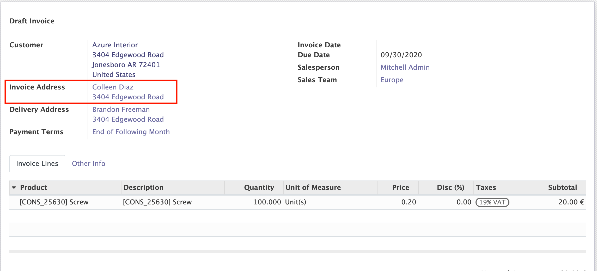

<a href="https://www.odoo.com/documentation/12.0/index.html">
</img>
</a>
<a href="http://www.alliantum.com">
</img>
</a>
<a href="http://www.gnu.org/licenses/agpl-3.0-standalone.html">
</img>
</a>

<h1>Invoice Adresses</h1>
Give the possibility to the user to enter an Invoice Address, when creating a new invoice.

***
***
***

# Usage

Install this add-on and it will be automatically ready to use it.

Now if you take a look at the invoice form you will see a new field `Invoice Address`.

Other than that in the same view if you check the next field (`Delivery Address`) the only options to choose are just the addresses assosiated with the company.

# Improvements

In order to print the report of the invoice this module adds the invoice address field and also the custom delivery address.

# Contributors

- [Alliantum](http://www.alliantum.com)

