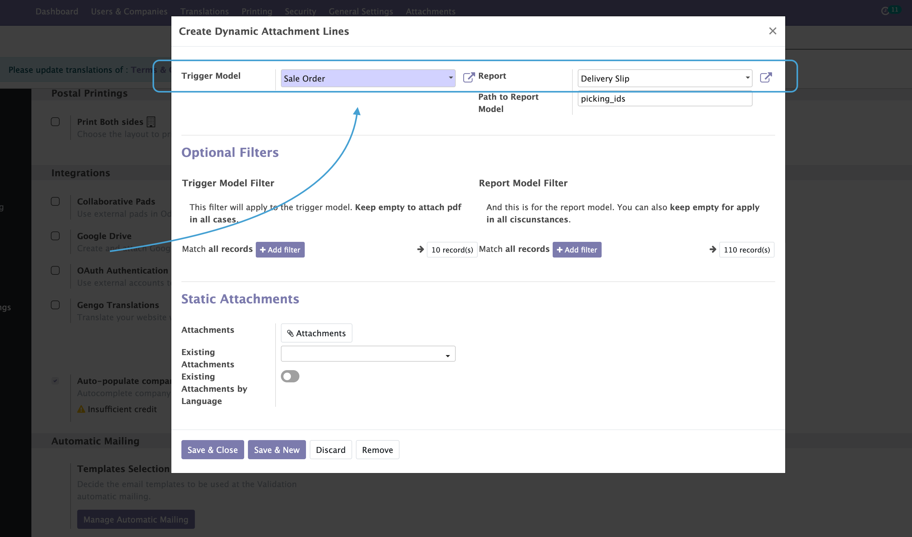

.. image:: static/description/alliantum.png
   :alt: Alliantum
   :width: 100 %
   :scale: 70 %
   :align: center

=========================
Mails Dynamic Attachments
=========================

.. !!!!!!!!!!!!!!!!!!!!!!!!!!!!!!!!!!!!!!!!!!!!!!!!!!!!
   !! This file is generated by oca-gen-addon-readme !!
   !! changes will be overwritten.                   !!
   !!!!!!!!!!!!!!!!!!!!!!!!!!!!!!!!!!!!!!!!!!!!!!!!!!!!

.. |badge1| image:: https://shields.io/badge/Beta-yellow?style=for-the-badge&label=Maturity
    :target: https://alliantum.com/development-status
    :alt: Beta
.. |badge2| image:: https://shields.io/badge/AGPL--3-blue?style=for-the-badge&label=License
    :target: http://www.gnu.org/licenses/agpl-3.0-standalone.html
    :alt: License: AGPL-3
.. |badge3| image:: https://shields.io/badge/Alliantum%2fodoo_mail_attachments-24c3f3?style=for-the-badge&logo=github&label=github
    :target: https://github.com/Alliantum/odoo_mail_attachments/tree/master
    :alt: Alliantum/odoo_mail_attachments

|badge1| |badge2| |badge3| 

By default, Odoo provides us with options to attach certain documents to
our email templates. They can be both, static files, like images, pdf,
text files… and also dynamic reports that are generated depending on the
current record, like for example a SO pdf to be sent to your customer.

But what happens when you would like to add more dynamic attachments,
like for example, not just the SO document, but also the Delivery Slips
of the related shipping for that SO? And even, do this just under
certain circumstances! That’s the point where this module become handy.

With this module you can start creating rules for objects like Sales
Order, Invoices, Purchases or another, that will decide which pdf
document will be attached to the emails sent from the context actions of
that object. The power of this module is that those pdf Documents can be
generated dynamically from related objects to the current one.

The rules will allow you to define under which circumstances, depending
on the fields of the current object you want the attachments to be
generated, filter the related objects, attach static files based on
rules, and attach static files based on languages.

**Table of contents**

.. contents::
   :local:

Configuration
=============

1. In order to add dynamically attachment to your emails. You must go to
   Settings / General Settings and scroll down to the bottom. A new
   section ``Dynamic Mail Attachments`` will have appeared there, then
   click on Manage button to launch the wizard and start creating rules.

.. image:: static/description/settings.png
   :alt: Alliantum
   :width: 100 %
   :scale: 70 %
   :align: center

2. Start adding attachments is very easy, just click ``Add a line``,
   then select the Model on which the current line will apply (for
   example, when sending an email from a Sale Order), and also decide
   the pdf Report to be used.

3. Now it’s very important to pay attention to the
   ``Path to Report Model`` field. Here you need to enter the path to
   follow starting from the ``Trigger Model`` to the records that will
   be used by the Report. For doing this you can use dot notation when
   needed (see example below), in picture picture, it’s just
   **``picking_ids``**. In case you don’t have access to the code used
   for create the objects, you can activate the developer mode in Odoo,
   and hover the fields to get the technical name of the field.

For example:

-  Your rule applies to Sale Order, then if you want to attach the
   Delivery Slip to a Sale Order, you simply have to enter
   ‘picking_ids’.
-  But, if your rule applies to Invoices for example, you will need
   maybe something like,
   ‘invoice_line_ids.sale_line_ids.order_id.picking_ids’. Notice here
   how the x2many fields are including here all the possible existing
   records.

.. image:: static/description/path.png
   :alt: Alliantum
   :width: 100 %
   :scale: 70 %
   :align: center

4. Filtering is also available to decide in which circumstances our rule
   line will take action. If you just need to attach certain file for a
   Sale Order, which Customer has some special value in a concrete
   field, let’s say, ``partner_id.is_premium``, then you can use the
   button **Add Filter** to enter a domain that matches your needs.
   Something similar can be also done for the related object, in our
   examples the Delivery.

.. image:: static/description/filtering.png
   :alt: Alliantum
   :width: 100 %
   :scale: 70 %
   :align: center

5. Continuing with more extra options, we can for instance attache
   static files in a couple of ways, one for adding to your email
   attachments that were already loaded in Odoo, or to upload on the fly
   a new one that really suits you.

6. And finally, there’s a powerful way of attaching files based on the
   language of one of the related records of the correct object (images
   that includes text, Terms and Conditions, or any other kind of
   document). You can think of it like, again, in a SO, when we need to
   attach some file in the language of our customer. Let’s say, that in
   out Sales Order, our Customer has set ``Language`` to French, in such
   a case, our configuration line will look like this:

.. image:: static/description/attach_languages.png
   :alt: Alliantum
   :width: 100 %
   :scale: 70 %
   :align: center

Usage
=====

Once everything is configured, the only thing you need to do is go ahead
to one of the objects that allow sending emails, and try sending one of
them, for one record that matched your rules criteria. Then in the
chatter, you should find the attachments that applies in that case.

Bug Tracker
===========

Bugs are tracked on `GitHub Issues <https://github.com/Alliantum/odoo_mail_attachments/issues>`_.
In case of trouble, please check there if your issue has already been reported.
If you spotted it first, help us smashing it by providing a detailed and welcomed
`feedback <https://github.com/Alliantum/odoo_mail_attachments/issues/new?body=module:%20odoo_mail_attachments%0Aversion:%20master%0A%0A**Steps%20to%20reproduce**%0A-%20...%0A%0A**Current%20behavior**%0A%0A**Expected%20behavior**>`_.

Do not contact contributors directly about support or help with technical issues.

Credits
=======

Authors
~~~~~~~

* Alliantum

Contributors
~~~~~~~~~~~~

-  David Moreno david.moreno@alliantum.com

Other credits
~~~~~~~~~~~~~

The development of this module has been financially supported by:

-  Alliantum (https://www.alliantum.com)

Maintainers
~~~~~~~~~~~

This module is maintained by Alliantum.

.. image:: https://avatars.githubusercontent.com/u/68618709?s=200&v=4
   :alt: Alliantum
   :target: https://alliantum.com

Alliantum, is a company whose
mission is to support the widespread use of Odoo by others companies, and collaborate in the development of new Odoo features.

This module is part of the `Alliantum/odoo_public_modules <https://github.com/Alliantum/odoo_public_modules>`_ project on GitHub.

You are welcome to contribute. To learn how please visit https://github.com/Alliantum/odoo_public_modules.

