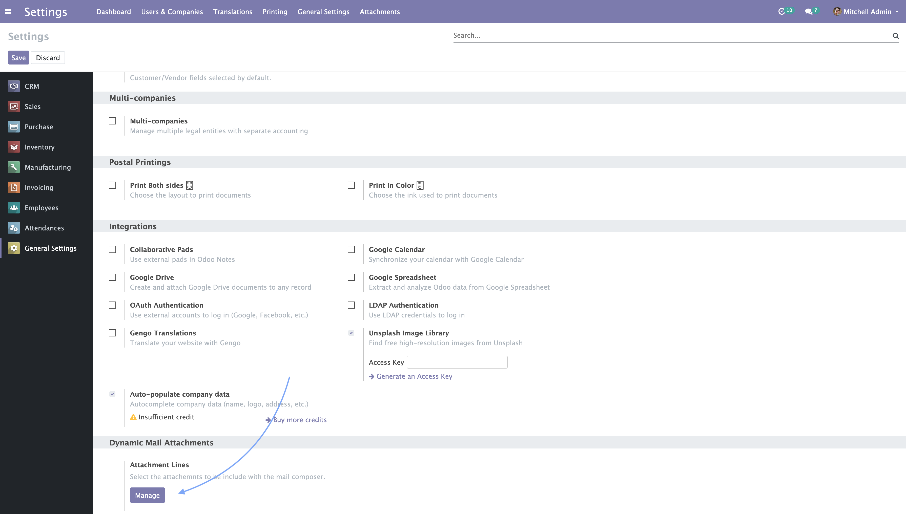
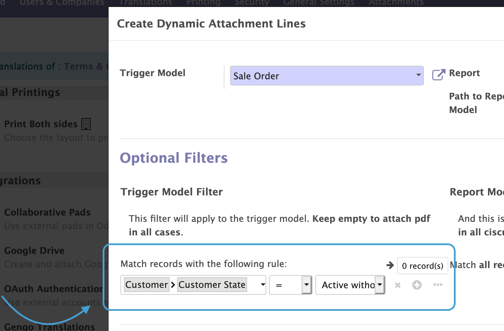
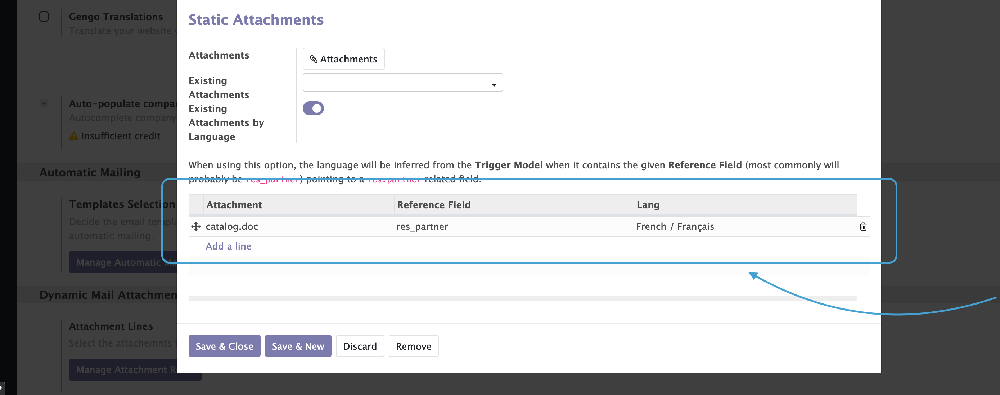

1. In order to add dynamically attachment to your emails. You must go to Settings / General Settings and scroll down to the bottom. A new section `Dynamic Mail Attachments` will have appeared there, then click on Manage button to launch the wizard and start creating rules.

    

2. Start adding attachments is very easy, just click `Add a line`, then select the Model on which the current line will apply (for example, when sending an email from a Sale Order), and also decide the pdf Report to be used.

    

3. Now it's very important to pay attention to the `Path to Report Model` field. Here you need to enter the path to follow starting from the `Trigger Model` to the records that will be used by the Report. For doing this you can use dot notation when needed (see example below), in picture picture, it's just **`picking_ids`**. In case you don't have access to the code used for create the objects, you can activate the developer mode in Odoo, and hover the fields to get the technical name of the field.

For example:

- Your rule applies to Sale Order, then if you want to attach the Delivery Slip to a Sale Order, you simply have to enter 'picking_ids'.
- But, if your rule applies to Invoices for example, you will need maybe something like, 'invoice_line_ids.sale_line_ids.order_id.picking_ids'. Notice here how the x2many fields are including here all the possible existing records.

    

4. Filtering is also available to decide in which circumstances our rule line will take action. If you just need to attach certain file for a Sale Order, which Customer has some special value in a concrete field, let's say, `partner_id.is_premium`, then you can use the button **Add Filter** to enter a domain that matches your needs. Something similar can be also done for the related object, in our examples the Delivery.

    

5. Continuing with more extra options, we can for instance attache static files in a couple of ways, one for adding to your email attachments that were already loaded in Odoo, or to upload on the fly a new one that really suits you.

6. And finally, there's a powerful way of attaching files based on the language of one of the related records of the correct object (images that includes text, Terms and Conditions, or any other kind of document). You can think of it like, again, in a SO, when we need to attach some file in the language of our customer. Let's say, that in out Sales Order, our Customer has set `Language` to French, in such a case, our configuration line will look like this:

    

