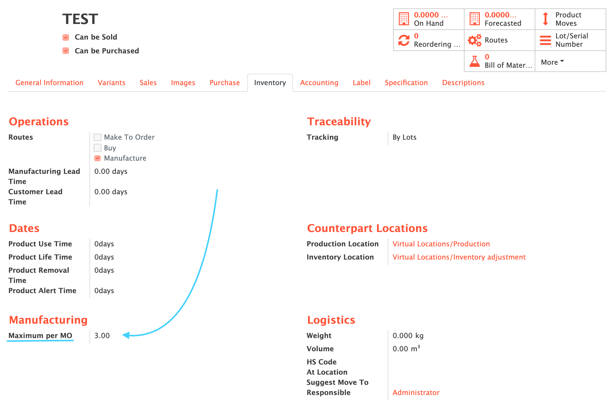
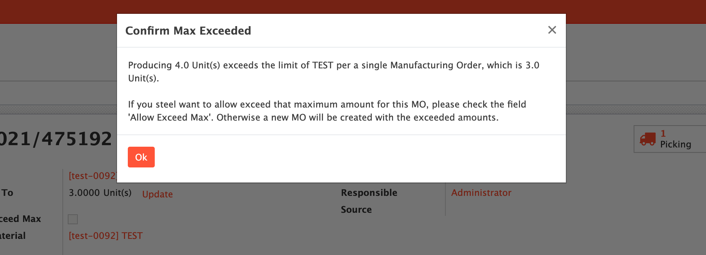

.. image:: static/description/alliantum.png
   :alt: Alliantum
   :width: 100 %
   :scale: 70 %
   :align: center

==============
MO Max. Amount
==============

.. !!!!!!!!!!!!!!!!!!!!!!!!!!!!!!!!!!!!!!!!!!!!!!!!!!!!
   !! This file is generated by oca-gen-addon-readme !!
   !! changes will be overwritten.                   !!
   !!!!!!!!!!!!!!!!!!!!!!!!!!!!!!!!!!!!!!!!!!!!!!!!!!!!

.. |badge1| image:: https://shields.io/badge/Beta-yellow?style=for-the-badge&label=Maturity
    :target: https://alliantum.com/development-status
    :alt: Beta
.. |badge2| image:: https://shields.io/badge/Alliantum%2fodoo_mo_maximum-24c3f3?style=for-the-badge&logo=github&label=github
    :target: https://github.com/Alliantum/odoo_mo_maximum/tree/14.0
    :alt: Alliantum/odoo_mo_maximum

|badge1| |badge2| 

Sets a maximum quantity for each product that can be manufactured on
single Manufacturing Order.

This will be the new field in the product view (both product and
variants)

**Table of contents**

.. contents::
   :local:

Installation
============

This module depends on ``mrp_production_grouped_by_product``. You can
find it at
`OCA/mrp_production_grouped_by_product <https://github.com/OCA/manufacture/tree/12.0/mrp_production_grouped_by_product>`__

Usage
=====

In order to trigger the blocking warning functionality you only need to
create a Manufacture Order with more units than what is in the “Maximum
per MO” field on the product

Bug Tracker
===========

Bugs are tracked on `GitHub Issues <https://github.com/Alliantum/odoo_mo_maximum/issues>`_.
In case of trouble, please check there if your issue has already been reported.
If you spotted it first, help us smashing it by providing a detailed and welcomed
`feedback <https://github.com/Alliantum/odoo_mo_maximum/issues/new?body=module:%20odoo_mo_maximum%0Aversion:%2014.0%0A%0A**Steps%20to%20reproduce**%0A-%20...%0A%0A**Current%20behavior**%0A%0A**Expected%20behavior**>`_.

Do not contact contributors directly about support or help with technical issues.

Credits
=======

Authors
~~~~~~~

* Alliantum

Contributors
~~~~~~~~~~~~

-  Aitor Rosell aitor.rosell@alliantum.com
-  David Moreno david.moreno@alliantum.com
-  Iago Alonso iago.alonso@alliantum.com

Other credits
~~~~~~~~~~~~~

The development of this module has been financially supported by:

-  Alliantum `www.alliantum.com <https://www.alliantum.com>`__

Maintainers
~~~~~~~~~~~

This module is maintained by Alliantum.

.. image:: https://avatars.githubusercontent.com/u/68618709?s=200&v=4
   :alt: Alliantum
   :target: https://alliantum.com

Alliantum, is a company whose
mission is to support the widespread use of Odoo by others companies, and collaborate in the development of new Odoo features.

This module is part of the `Alliantum/odoo_public_modules <https://github.com/Alliantum/odoo_public_modules>`_ project on GitHub.

You are welcome to contribute. To learn how please visit https://github.com/Alliantum/odoo_public_modules.

