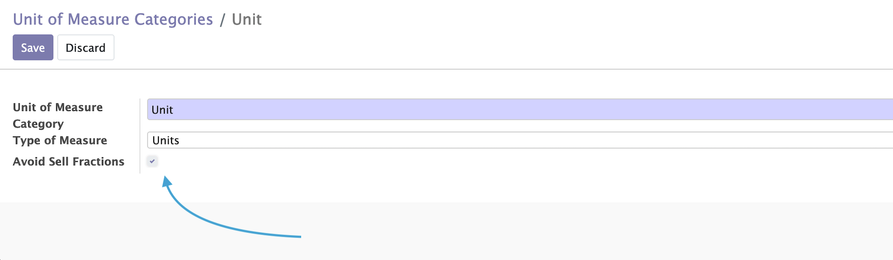
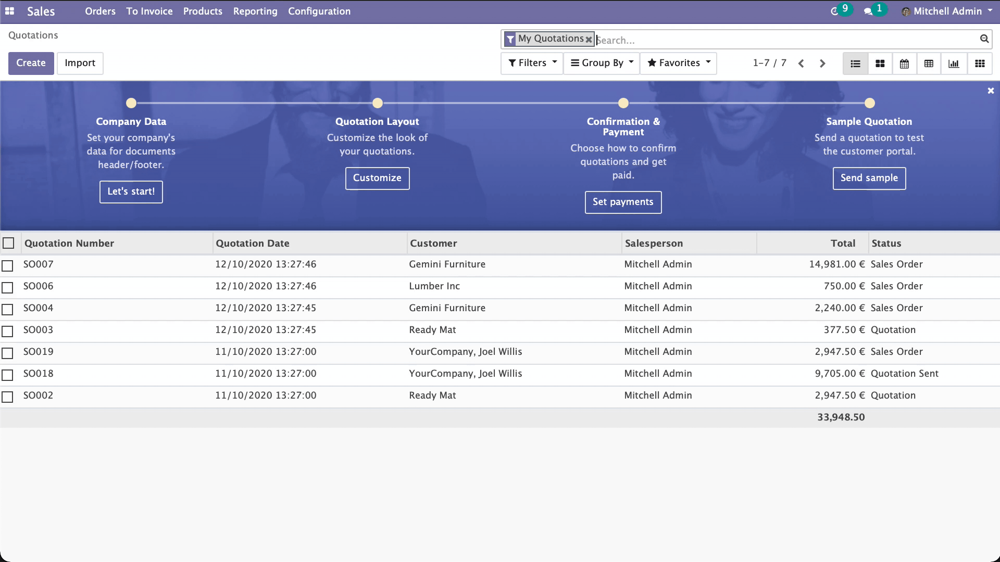

.. image:: static/description/alliantum.png
   :alt: Alliantum
   :width: 100 %
   :scale: 70 %
   :align: center

===================
Avoid UoM Fractions
===================

.. !!!!!!!!!!!!!!!!!!!!!!!!!!!!!!!!!!!!!!!!!!!!!!!!!!!!
   !! This file is generated by oca-gen-addon-readme !!
   !! changes will be overwritten.                   !!
   !!!!!!!!!!!!!!!!!!!!!!!!!!!!!!!!!!!!!!!!!!!!!!!!!!!!

.. |badge1| image:: https://shields.io/badge/Beta-yellow?style=for-the-badge&label=Maturity
    :target: https://alliantum.com/development-status
    :alt: Beta
.. |badge2| image:: https://shields.io/badge/AGPL--3-blue?style=for-the-badge&label=License
    :target: http://www.gnu.org/licenses/agpl-3.0-standalone.html
    :alt: License: AGPL-3
.. |badge3| image:: https://shields.io/badge/Alliantum%2fodoo_no_fractions-24c3f3?style=for-the-badge&logo=github&label=github
    :target: https://github.com/Alliantum/odoo_no_fractions/tree/master
    :alt: Alliantum/odoo_no_fractions

|badge1| |badge2| |badge3| 

Sometimes is a problem when you or any of your employee casually sells
parts of one of your products that are supposed to be just sold in a
“single block” (even maybe, if internally is possible for you to move
parts of that product). That can be annoying if happen too often and
maybe you don’t notice it on time. So that’s where this module can be
helpful, making it easy to avoid selling parts of products to your
customers that uses certain categories of Units of Measure.

**Table of contents**

.. contents::
   :local:

Configuration
=============

To configure this module, you just need to go to Inventory /
Configuration / UoM Categories, and there select the UoM Category that
you want to avoid selling in fractions. Once inside, check the box
``Avoid Sell Fractions``.

Usage
=====

To use this module, after having configured it, you can go to a SO a try
to sell a product, using fractions for the UoM Category that you just
configured:

You should then receive a warning while you’re editing those quantities
to sell, and even if you continue and try to save your changes, and
exception will be raised, and will not be possible to save the current
SO (or Invoice).

Bug Tracker
===========

Bugs are tracked on `GitHub Issues <https://github.com/Alliantum/odoo_no_fractions/issues>`_.
In case of trouble, please check there if your issue has already been reported.
If you spotted it first, help us smashing it by providing a detailed and welcomed
`feedback <https://github.com/Alliantum/odoo_no_fractions/issues/new?body=module:%20odoo_no_fractions%0Aversion:%20master%0A%0A**Steps%20to%20reproduce**%0A-%20...%0A%0A**Current%20behavior**%0A%0A**Expected%20behavior**>`_.

Do not contact contributors directly about support or help with technical issues.

Credits
=======

Authors
~~~~~~~

* Alliantum

Contributors
~~~~~~~~~~~~

-  David Moreno david.moreno@alliantum.com
-  Iago Alonso iago.alonso@alliantum.com

Other credits
~~~~~~~~~~~~~

The development of this module has been financially supported by:

-  Alliantum (https://www.alliantum.com)

Maintainers
~~~~~~~~~~~

This module is maintained by Alliantum.

.. image:: https://avatars.githubusercontent.com/u/68618709?s=200&v=4
   :alt: Alliantum
   :target: https://alliantum.com

Alliantum, is a company whose
mission is to support the widespread use of Odoo by others companies, and collaborate in the development of new Odoo features.

This module is part of the `Alliantum/odoo_public_modules <https://github.com/Alliantum/odoo_public_modules>`_ project on GitHub.

You are welcome to contribute. To learn how please visit https://github.com/Alliantum/odoo_public_modules.

