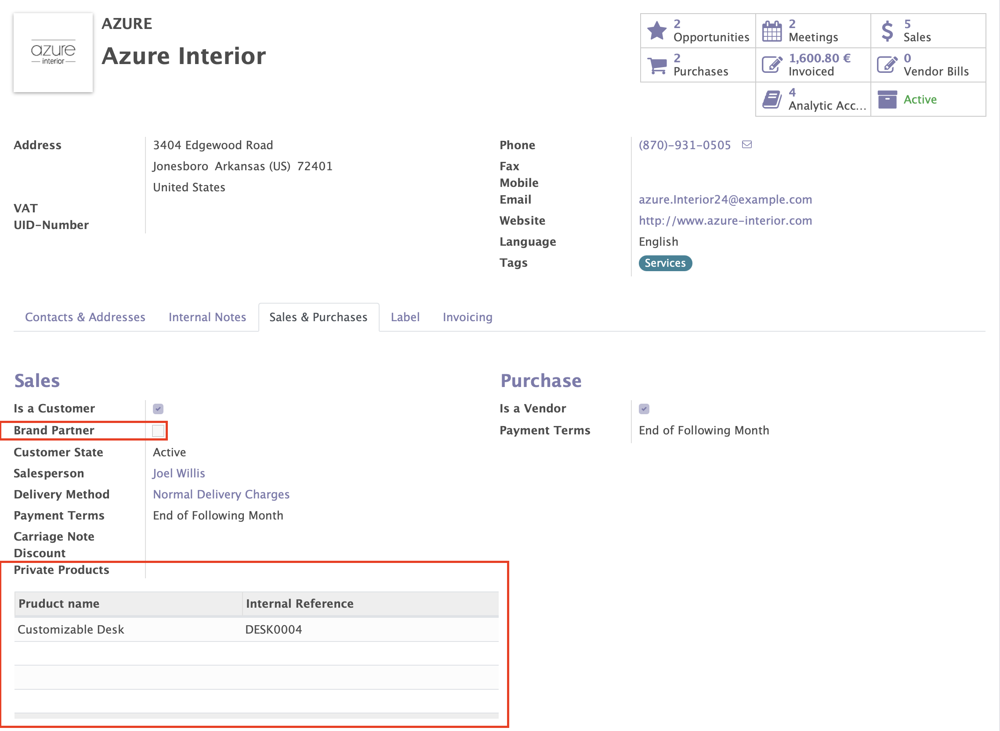

.. image:: static/description/alliantum.png
   :alt: Alliantum
   :width: 100 %
   :scale: 70 %
   :align: center

======================
Brand Partner Products
======================

.. !!!!!!!!!!!!!!!!!!!!!!!!!!!!!!!!!!!!!!!!!!!!!!!!!!!!
   !! This file is generated by oca-gen-addon-readme !!
   !! changes will be overwritten.                   !!
   !!!!!!!!!!!!!!!!!!!!!!!!!!!!!!!!!!!!!!!!!!!!!!!!!!!!

.. |badge1| image:: https://shields.io/badge/Beta-yellow?style=for-the-badge&label=Maturity
    :target: https://alliantum.com/development-status
    :alt: Beta
.. |badge2| image:: https://shields.io/badge/AGPL--3-blue?style=for-the-badge&label=License
    :target: http://www.gnu.org/licenses/agpl-3.0-standalone.html
    :alt: License: AGPL-3
.. |badge3| image:: https://shields.io/badge/Alliantum%2fodoo_private_product-24c3f3?style=for-the-badge&logo=github&label=github
    :target: https://github.com/Alliantum/odoo_private_product/tree/master
    :alt: Alliantum/odoo_private_product

|badge1| |badge2| |badge3| 

Maybe, some of your sellable products are just for one or some of your
customers, and you’d like avoid selling them to any other company. This
module helps with this efficiently and avoid making errors.

**Table of contents**

.. contents::
   :local:

Installation
============

Install this add-on and it will be automatically ready to use.

Configuration
=============

Just install it, go to your Customer view, and enter one of them. There
you will see under the tab ``Sales & Purchase`` a couple of new fields.
One of them *Brand Partner* will help you filtering your customers and
organize things better. The other one, *Private Products* is the place
were include those products that you consider can just be sold to this
Customer specifically. You can also add that same product to any other
of your customer, and then they both will share the same products.

Or, if you prefer, you can do all of this just directly from the Product
form view. Go to you product, in the Sales tab, and look at the bottom
for the ``Customers Limited`` section. There you can include the
contacts that can only buy this product, beside deciding which kind of
status you want to consider for this special treatment (optionally for
reporting or organization purposes).

.. image:: static/description/product_screenshot.png
   :alt: Alliantum
   :width: 100 %
   :scale: 70 %
   :align: center

Usage
=====

Once everything is installed and configured. Try try your new module,
you can go both to a Sale Order or to an Invoice, enter any of your
customer, and then try to add one of those products that can just be
sold to a particular company, if your Invoice or SO customer is
different from the one specified in the product, an exception will be
raised and the changes will not be applied. You’ll get also an
explanatory message of what just happened and then you can decide what
to do.

.. image:: static/description/usage.png
   :alt: Alliantum
   :width: 100 %
   :scale: 70 %
   :align: center

Bug Tracker
===========

Bugs are tracked on `GitHub Issues <https://github.com/Alliantum/odoo_private_product/issues>`_.
In case of trouble, please check there if your issue has already been reported.
If you spotted it first, help us smashing it by providing a detailed and welcomed
`feedback <https://github.com/Alliantum/odoo_private_product/issues/new?body=module:%20odoo_private_product%0Aversion:%20master%0A%0A**Steps%20to%20reproduce**%0A-%20...%0A%0A**Current%20behavior**%0A%0A**Expected%20behavior**>`_.

Do not contact contributors directly about support or help with technical issues.

Credits
=======

Authors
~~~~~~~

* Alliantum

Contributors
~~~~~~~~~~~~

-  David Moreno david.moreno@alliantum.com
-  Iago Alonso iago.alonso@alliantum.com

Other credits
~~~~~~~~~~~~~

The development of this module has been financially supported by:

-  Alliantum (https://www.alliantum.com)

Maintainers
~~~~~~~~~~~

This module is maintained by Alliantum.

.. image:: https://avatars.githubusercontent.com/u/68618709?s=200&v=4
   :alt: Alliantum
   :target: https://alliantum.com

Alliantum, is a company whose
mission is to support the widespread use of Odoo by others companies, and collaborate in the development of new Odoo features.

This module is part of the `Alliantum/odoo_public_modules <https://github.com/Alliantum/odoo_public_modules>`_ project on GitHub.

You are welcome to contribute. To learn how please visit https://github.com/Alliantum/odoo_public_modules.

