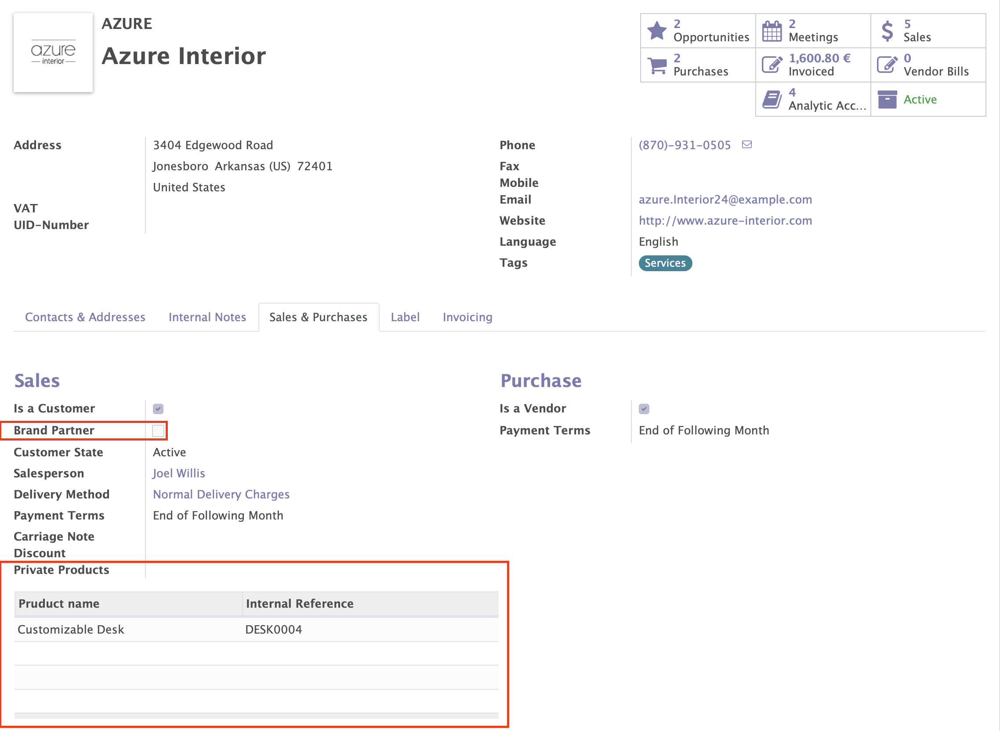

Just install it, go to your Customer view, and enter one of them. There you will see under the tab `Sales & Purchase` a couple of new fields. One of them _Brand Partner_  will help you filtering your customers and organize things better. The other one, _Private Products_ is the place were include those products that you consider can just be sold to this Customer specifically. You can also add that same product to any other of your customer, and then they both will share the same products.

    

Or, if you prefer, you can do all of this just directly from the Product form view. Go to you product, in the Sales tab, and look at the bottom for the `Customers Limited` section. There you can include the contacts that can only buy this product, beside deciding which kind of status you want to consider for this special treatment (optionally for reporting or organization purposes).

    

